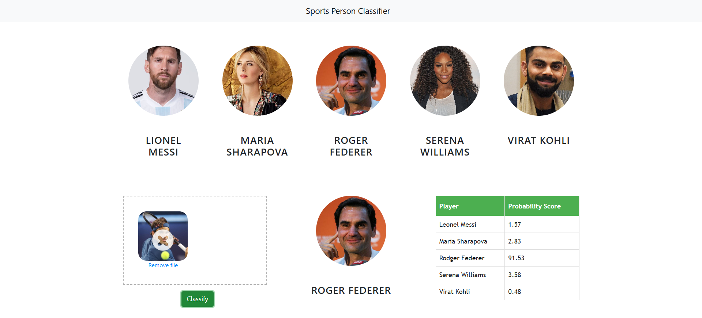

In this data science and machine learning project, we classify sports personalities. We restrict classification to only 5 people,

Maria Sharapova
Serena Williams
Virat Kohli
Roger Federer
Lionel Messi
Here is the folder structure,

UI : This contains ui website code
server: Python flask server (FastAPI is also used as alternative approach)
model: Contains python notebook for model building
google_image_scrapping: code to scrap google for images
images_dataset: Dataset used for our model training
Technologies used in this project,

Python
Numpy and OpenCV for data cleaning
Matplotlib & Seaborn for data visualization
Sklearn for model building
Visual studio code IDE
Python flask for http server (FastAPI is also used as alternative approach)
HTML/CSS/Javascript for UI